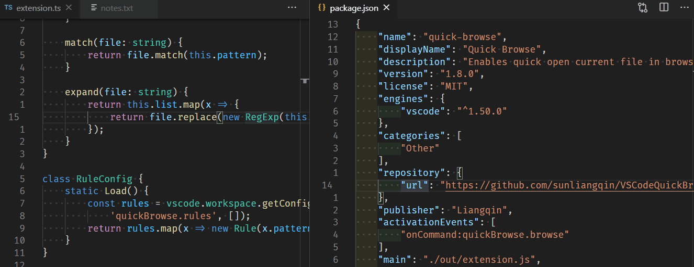

# Introduction
## This extension enables you jump to anywhere with two key strokes.

# Settings
* `quickJump.anchors`: Anchor signs (default: hklyuiopnm,qwertzxcvbasdgjf;0123456789/)
* `quickJump.regex`: Custom regex to match for anchors (default: \\b\\w|\\w\\b|\\w(?=\_)|(?<=\_)\\w|(?<=[a-z0-9])[A-Z])
* `quickJump.textColor`: The font color for other text (default: #777777)
* `quickJump.blockAnchorColor`: The font color for block anchor (default: #ffb400)
* `quickJump.wordAnchorColor`: The font color for the word anchor (default: #ff0000)
* `quickJump.jumpBeforeAnchor`: Jump before anchor (default: false) **Set this to true if you have VIM extension installed**
* `quickJump.columns`: Number of columns you can jump (default: 300)